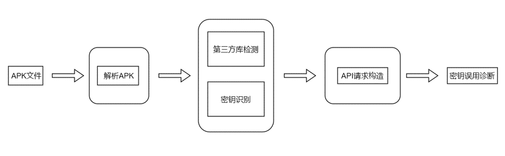
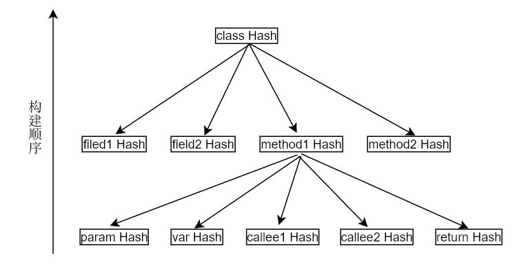
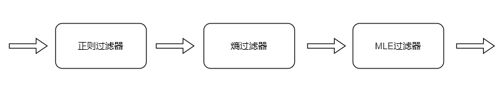
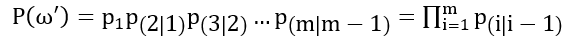
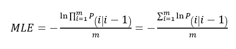

# 面向Android应用的密钥误用检测技术研究

## 研究背景

云服务的接入带来了更多的数据泄漏事故，很重要的一个原因是开发者在其客户端错误地使用了访问密钥。[SP'19](https://ieeexplore.ieee.org/document/8835301) 上的一篇文章对此问题进行了研究并设计了自动化检测方案，本repo对其部分内容的复现，实现了一个2000行Java代码的自动化检测工具。

## 使用方法

```shell script
java -jar keyshot.jar -a path_to_android.jar -i path_to_apk -j path_to_rules [-options]
```

options:
```
-r recursive path to apk
-u update rules
```

## 系统设计



1. Apk解析子系统：主要功能是绘制函数（Java中的方法，method）调用关系图和源代码切片，以用于后续的Merkle树的构造和密钥识别。
2. Apk解析子系统：主要功能是绘制函数（Java中的方法，method）调用关系图和源代码切片，以用于后续的Merkle树的构造和密钥识别。
3. 密钥识别子系统：旨在尽可能地识别出apk中的所有密钥。对apk中所有的字符串常量进行处理，以每个切片作为处理单元，设置有正则、熵、最大似然估计三个必选过滤器，和可选的base编码过滤器，识别可能的密钥。
4. API请求构造子系统：利用识别出的密钥和第三方库，构造真实的恰当的API请求，在不造成真实数据泄漏的前提下，根据请求返回的结果，判断密钥使用正误。

## 详细设计

### APK解析子系统

此部分主要基于flowdroid开发，flowdroid是一款功能强大的Android应用和Java程序的静态分析工具。Flowdroid提供了获取类成员变量、成员方法、方法形式参数、方法返回值的API，但方法局部变量和内部调用的功能仍需自行开发。

Flowdroid可以将.dex的Dalvik指令反汇编Smali语句将Java方法反汇编为Smali语言后，invoke语句所调用的方法作为内部调用，形成有序表。move作为本地变量，同时move中的String变量和const-string常量汇入当前类的字符串切片。

在获取方法的本地调用后，需选择合适的数据结构代表函数关系调用图。在Java程序中的方法众多，而调用相对较少，使得图的顶点远大于边的数量，使用邻接表可以减小空间开支及提升运算效率。

### 第三方库检测子系统

云服务商为方便开发者使用自己的API，将其打包成库共享到互联网。此子系统旨在检测由云服务商开发的这部分第三方库。将第三方库检测作为密钥识别的前置条件，可以减小识别范围，区分识别不同的密钥，提高精确度。

由于部分第三方库支持混淆，所以无法简单的依靠包名检测。而Java方法间的调用关系、成员变量及局部变量的相对申请顺序、类的派生和继承关系不会因混淆而改变，这些可以用来作为第三方库的特征。

Keyshoot的第三方库检测子系统采用Merkle树。Keyshoot在Java方法层之下，利用局部变量和方法调用来构造Merkle树，其结构如图所示。同时为了避免Merkle树发生哈希碰撞，Keyshoot采用SHA-256算法来生成唯一指纹签名。



### 密钥识别子系统

由于开发习惯和工程规范，成对的密钥（AccessKey和SecretKey）总是在相近的位置被声明和赋值，基本都在同一个类文件中，所以在经过apk解析子系统的切片后，已经完成了预处理，只需要在每个片段中识别成对的密钥即可。



密钥识别子系统设置了三个必选过滤器和一个可选过滤器，三个过滤器如图所示级联。在研究了多家云服务后，发现有部分密钥采用base64编码，有额外设置了一个可选的base64过滤器，若可以经base64解码，则通过。同时还发现同一家云服务商提供的密钥长度是相同的，且可能有固定的字符头，很容易通过正则匹配到。以下内容重点介绍最大似然估计过滤器。

#### 最大似然估计过滤器

最大似然估计（maximum likelihood estimation，缩写为MLE）是高斯提出的，利用已知样本结果，在使用某一概率模型的前提下，反向估算参数的方法。现需要一种合适的模型，以反向估算字符串是否是随机生成的。

在自然语言环境中，26个英文字母（此过滤器中不区分大小写）及不同的字母组合被使用的频率是不同的，即人工生成的字符串中，下一字符的选择会受当前字符的影响。根据这一规律，Keyshoot将最大似然估计代入一阶马尔可夫过程。
对于给定的字符串ω，先过滤掉所有的26个英文字母以外的字符，用剩余的字符保持相对顺序不变全部转换为小写字母，生成新的字符串ω'。则新字符串的一阶马尔可夫概率模型为：



其中p_1为字母表中出现在单词中第一位置的统计概率， p_(i│i-1)  为利用Google Ngrams语料库计算出的二元字母组合的条件概率。当字符串足够长时，计算出的概率P(ω' )可能超出浮点数的范围，发生下溢归零，同时为了和熵过滤器的单调性保持一致，就取P(ω' )的负对数。而字符串ω转化为ω'时，字符串的长度发生了不确定性的改变，所以最终还要除以ω'的长度进行正规化。最终的概率模型公式如下：



### API请求构造子系统

在获得app所使用的API及其密钥后，还需要判断该密钥的类型： RootKey或UserKey。

一般来说，RootKey和UserKey具有相同的结构和随机性特征，无法在本地环境中进去区分，所以只有去访问云服务器进行测试。一种直接的方法是使用密钥将请求发送到服务器来访问RootKey专有数据。如果能够检索这些数据，则证明该密钥是RootKey。

在研究各个云服务商提供的开发者文档后，发现了以下两种有利的条件：

1. 不同权限的密钥访问云中不存在的数据时，服务器通常会返回不同的响应消息。若是RootKey，则会返回数据不存在，而UserKey会警告无访问权限。
2. 部分UserKey只用来获取临时访问口令，使用临时口令来访问数据，而其本身不具有任何文件的访问权限。

所以此子系统会构造请求去访问随机的基本不可能存在的路径。无论是哪种密钥，都不会造成真实数据的泄漏，但根据不同的返回结果可以判断密钥的类型。在这一部分的开发过程中，子系统将集成云服务商提供的SDK，使用合法的API进行请求。

## 实验评估

检测从 [酷安网 | CoolApk](https://coolapk.com/) 爬取的3153个apk共耗时约25小时，平均每个apk耗时28秒。日志文件统计表示，其中有48个apk可能存在加壳等反反编译技术，解包失败，故有效检测apk数量为3105个。

实验只检测阿里、腾讯、百度三家云服务商场提供的SDK，共检测出297个app使用，使用率达9.57%。在这些app中有94个使用了混淆手段，占比31.65%。密钥使用错误的有8个，误用率为2.69%，占总检测数量的0.26%。